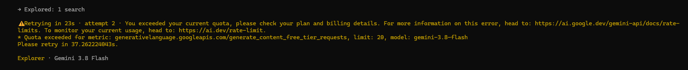

# Sleep Gemini

[English](README.md) | [Português (Brasil)](README.pt-BR.md)

An OpenCode plugin that handles Gemini API `429` rate-limit responses by honoring Google's suggested retry delay and adding a small random buffer. It is intended for OpenCode users who run Gemini-powered agents and occasionally hit short-lived request quotas.



## How it works

The plugin registers OpenCode's session `retry` hook and changes the retry decision only when all of these are true:

1. The provider ID is `google`.
2. The model ID contains `gemini`.
3. The provider error has HTTP status `429`.

For a matching error, it parses a delay such as `Please retry in 21.075s.`, rounds it up to milliseconds, and adds a random **1–10 seconds**. This jitter helps avoid concurrent agents retrying at precisely the same moment.

The plugin permits at most **3 total attempts per request**: the initial request and up to two retries. Once the limit is reached, it stops retrying that request.

## What it does not do

- It does not switch to another model or provider.
- It does not increase, reserve, or otherwise change your Google API quota.
- It does not coordinate requests across different agents or sessions.
- If the error message has no parseable retry duration, it leaves OpenCode's existing retry decision unchanged.

## Requirements

- OpenCode with the session `retry` plugin hook (OpenCode V2).
- A Gemini model routed through provider ID `google`.
- No additional npm dependencies.

## Install

OpenCode automatically loads project plugins from `.opencode/plugins/`. To use this plugin in a project, copy it there:

### Windows (PowerShell)

```powershell
New-Item -ItemType Directory -Force .\.opencode\plugins | Out-Null
Copy-Item .\gemini-quota-retry.ts .\.opencode\plugins\gemini-quota-retry.ts
```

### macOS / Linux

```sh
mkdir -p .opencode/plugins
cp ./gemini-quota-retry.ts .opencode/plugins/gemini-quota-retry.ts
```

To enable it for every project for your user, put the file in the global OpenCode plugins directory instead:

```text
Windows:  %USERPROFILE%\.config\opencode\plugins\gemini-quota-retry.ts
macOS/Linux: ~/.config/opencode/plugins/gemini-quota-retry.ts
```

Restart OpenCode after installing. If a file with the same name already exists, back it up before replacing it.

## Configuration

The initial settings are constants at the top of `gemini-quota-retry.ts`:

```ts
const MAX_TOTAL_ATTEMPTS = 3
const EXTRA_DELAY_MIN_MS = 1_000
const EXTRA_DELAY_MAX_MS = 10_000
```

Change these values to tune the retry budget or jitter range. `MAX_TOTAL_ATTEMPTS` includes the original request.

## Development and verification

The delay parser is exported so it can be checked independently. With Node.js 24 or later:

```sh
node --experimental-strip-types --input-type=module -e "import('./gemini-quota-retry.ts').then(({parseGeminiRetryDelayMs}) => console.log(parseGeminiRetryDelayMs('Please retry in 21.075083893s.')))"
```

Expected output:

```text
21076
```

This checks parsing only; it does not make a request to Google. During use, retry decisions are logged with the `[gemini-quota-retry]` prefix in the OpenCode server log.